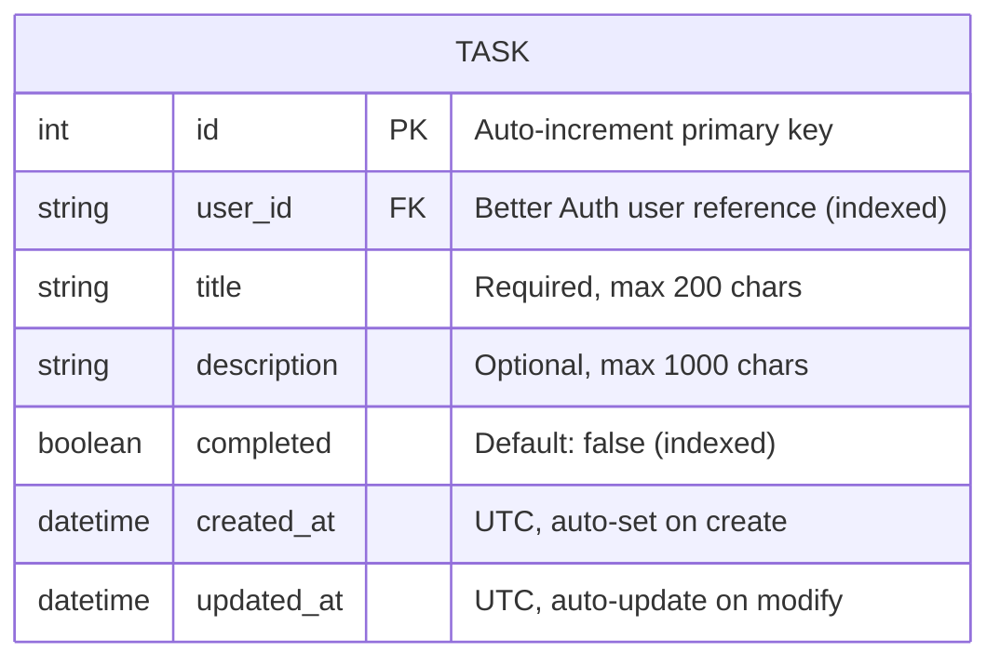
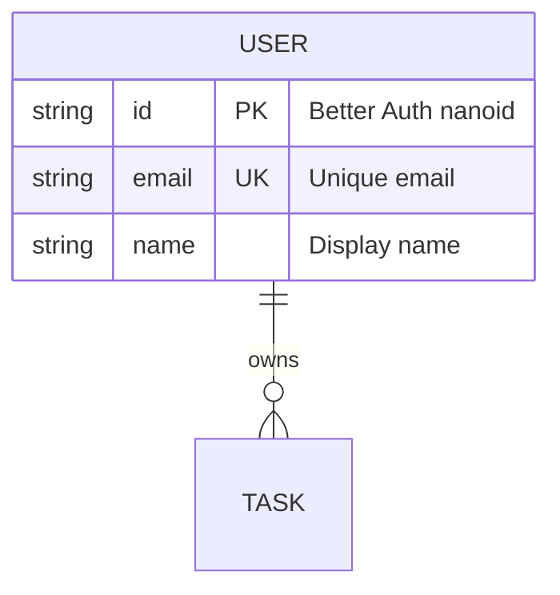
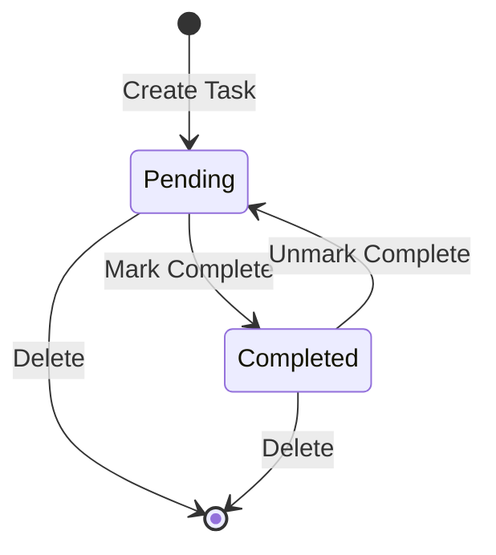

# Data Model: Database Schema for Todo App

**Created**: 2026-01-08
**Feature**: 003-database-schema

## Entity: Task

### Schema



### Field Specifications

| Field | Type | Constraints | Notes |
|-------|------|-------------|-------|
| `id` | INTEGER | PRIMARY KEY, AUTOINCREMENT | SQLModel auto-generates |
| `user_id` | VARCHAR(255) | NOT NULL, INDEXED | Better Auth user reference |
| `title` | VARCHAR(200) | NOT NULL | Required, validated |
| `description` | VARCHAR(1000) | NULLABLE | Optional |
| `completed` | BOOLEAN | NOT NULL, DEFAULT FALSE, INDEXED | Status filter |
| `created_at` | TIMESTAMP WITH TIME ZONE | NOT NULL, DEFAULT NOW() | UTC |
| `updated_at` | TIMESTAMP WITH TIME ZONE | NOT NULL | Updated on modify |

### Indexes

| Index Name | Column(s) | Purpose |
|------------|-----------|---------|
| `ix_task_user_id` | `user_id` | Filter tasks by user (every query) |
| `ix_task_completed` | `completed` | Filter by completion status |

### SQLModel Implementation

```python
from datetime import datetime
from sqlmodel import SQLModel, Field


class Task(SQLModel, table=True):
    """A todo task belonging to a user."""

    __tablename__ = "task"

    id: int | None = Field(default=None, primary_key=True)
    user_id: str = Field(index=True, max_length=255)
    title: str = Field(max_length=200)
    description: str | None = Field(default=None, max_length=1000)
    completed: bool = Field(default=False, index=True)
    created_at: datetime = Field(default_factory=datetime.utcnow)
    updated_at: datetime = Field(default_factory=datetime.utcnow)
```

---

## Entity: User (Reference Only)

> **Note**: User table is managed by Better Auth. Task references users by `user_id` but does not define a foreign key constraint. User validation happens at API layer during JWT verification.



---

## Data Validation Rules

| Rule | Level | Implementation |
|------|-------|----------------|
| Title required | Model + DB | `NOT NULL` + Pydantic validation |
| Title max 200 chars | Model | `Field(max_length=200)` |
| Description max 1000 chars | Model | `Field(max_length=1000)` |
| Completed defaults to false | Model + DB | `Field(default=False)` |
| Timestamps in UTC | Application | `datetime.utcnow()` |
| User isolation | API | Filter by JWT `user_id` |

---

## State Transitions


