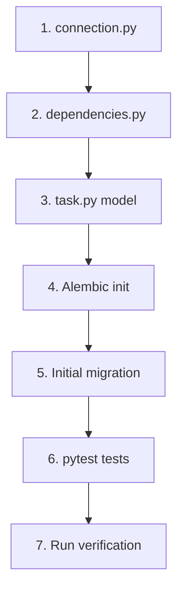

# Implementation Plan: Database Schema for Todo App (Module 2)

**Feature Branch**: `003-database-schema`
**Created**: 2026-01-08
**Status**: Draft
**Feature Spec**: [spec.md](file:///d:/GIAIC/Quarter%204/Hackathon/Project%202/hackathon-todo/specs/003-database-schema/spec.md)

## Technical Context

| Aspect | Decision | Source |
|--------|----------|--------|
| Database Provider | Neon PostgreSQL (free tier) | User input |
| ORM | SQLModel with async support | Constitution |
| Driver | asyncpg (async PostgreSQL) | Constitution |
| Migrations | Alembic (async template) | Constitution |
| Auth | Better Auth user_id (string FK) | Constitution |
| Existing Backend | FastAPI at `todo-web-app/backend/` | Verified |
| DATABASE_URL | Already configured in `.env` | Verified |

## Constitution Check

| Principle | Gate | Status |
|-----------|------|--------|
| III. Database Architecture | SQLModel for all DB interactions | ✅ Pass |
| III. Database Architecture | Alembic for ALL schema changes | ✅ Pass |
| III. Database Architecture | Indexes on `user_id`, `completed` | ✅ Pass |
| III. Database Architecture | UTC timestamps | ✅ Pass |
| II. FastAPI Backend | Async-first with asyncpg | ✅ Pass |
| II. FastAPI Backend | Dependency injection for sessions | ✅ Pass |
| VI. TDD | pytest with pytest-asyncio | ✅ Pass |
| VII. Type Safety | Python type hints on all functions | ✅ Pass |

---

## Proposed Changes

### Database Connection Layer

#### [NEW] [connection.py](file:///d:/GIAIC/Quarter%204/Hackathon/Project%202/hackathon-todo/todo-web-app/backend/src/db/connection.py)

Async engine and session factory:
- `get_async_database_url()` - converts `postgresql://` to `postgresql+asyncpg://`
- `engine` - create_async_engine with pool_pre_ping=True
- `create_db_and_tables()` - for development/testing table creation

#### [MODIFY] [__init__.py](file:///d:/GIAIC/Quarter%204/Hackathon/Project%202/hackathon-todo/todo-web-app/backend/src/db/__init__.py)

Export connection utilities.

---

### FastAPI Dependencies

#### [NEW] [dependencies.py](file:///d:/GIAIC/Quarter%204/Hackathon/Project%202/hackathon-todo/todo-web-app/backend/src/db/dependencies.py)

- `get_session()` - AsyncGenerator yielding AsyncSession for FastAPI Depends()

---

### SQLModel Models

#### [NEW] [task.py](file:///d:/GIAIC/Quarter%204/Hackathon/Project%202/hackathon-todo/todo-web-app/backend/src/models/task.py)

Task model with:
- `id`: int, primary key, auto-increment
- `user_id`: str, indexed, foreign key reference to Better Auth users
- `title`: str, max_length=200, required
- `description`: str | None, max_length=1000
- `completed`: bool, default=False
- `created_at`: datetime, default=utcnow
- `updated_at`: datetime, auto-update on modification

#### [MODIFY] [__init__.py](file:///d:/GIAIC/Quarter%204/Hackathon/Project%202/hackathon-todo/todo-web-app/backend/src/models/__init__.py)

Export Task model for Alembic autogenerate detection.

---

### Alembic Migrations

#### [NEW] [alembic/](file:///d:/GIAIC/Quarter%204/Hackathon/Project%202/hackathon-todo/todo-web-app/backend/alembic/)

Initialize with async template:

```bash
cd todo-web-app/backend
alembic init -t async alembic
```

#### [MODIFY] alembic.ini

Set `sqlalchemy.url` to empty (loaded from env).

#### [MODIFY] alembic/env.py

Configure for:
- Async engine with asyncpg
- Import SQLModel.metadata
- Import all models for autogenerate

#### [NEW] Initial Migration

```bash
alembic revision --autogenerate -m "create_tasks_table"
alembic upgrade head
```

---

### Tests

#### [NEW] [tests/](file:///d:/GIAIC/Quarter%204/Hackathon/Project%202/hackathon-todo/todo-web-app/backend/tests/)

Create test directory with:
- `conftest.py` - async fixtures, test database session
- `test_task_crud.py` - CRUD operation tests

---

## Verification Plan

### Automated Tests

| Test | Command | Coverage |
|------|---------|----------|
| CRUD Operations | `uv run pytest tests/test_task_crud.py -v` | Create, Read, Update, Delete tasks |
| Full Suite | `uv run pytest -v` | All backend tests |

**Test Cases**:
1. Create task with valid data → returns task with auto-generated ID
2. Read task by ID → returns correct task
3. Update task title/description → persists changes
4. Delete task → task no longer retrievable
5. Query by user_id → returns only user's tasks (data isolation)
6. Query by completed status → returns filtered results

### Database Verification

| Check | Command |
|-------|---------|
| Migration applies | `cd todo-web-app/backend && alembic upgrade head` |
| Tables exist | Neon console or `\dt` in psql |
| Indexes created | `\di tasks_user_id_idx` in psql |

### Manual Verification

1. **Connection Test**: Run `uv run python -c "from src.db.connection import engine; print('OK')"` to verify engine creation
2. **Neon Console**: Open Neon dashboard and verify `tasks` table exists with correct columns

---

## Implementation Order



## Risk Analysis

| Risk | Mitigation |
|------|------------|
| DATABASE_URL format mismatch | `get_async_database_url()` handles conversion |
| Neon connection drops | `pool_pre_ping=True` validates connections |
| Migration rollback needed | Alembic supports `downgrade -1` |

---

## Files Summary

| Action | Path | Purpose |
|--------|------|---------|
| NEW | `src/db/connection.py` | Async engine, URL conversion |
| NEW | `src/db/dependencies.py` | FastAPI session dependency |
| NEW | `src/models/task.py` | Task SQLModel entity |
| MODIFY | `src/models/__init__.py` | Export Task |
| MODIFY | `src/db/__init__.py` | Export connection utils |
| NEW | `alembic/` | Migration infrastructure |
| NEW | `tests/conftest.py` | Test fixtures |
| NEW | `tests/test_task_crud.py` | CRUD tests |
