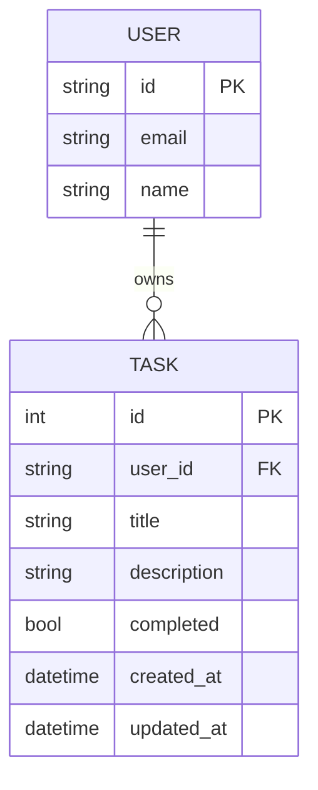

# Data Model: Task API

## Entities

### Task (SQLModel - Existing)

| Field | Type | Constraints | Notes |
|-------|------|-------------|-------|
| id | int | Primary key, auto-increment | Auto-generated |
| user_id | str | Indexed, max 255 chars | Better Auth user reference |
| title | str | Required, max 200 chars | Task name |
| description | str \| None | Optional, max 1000 chars | Additional details |
| completed | bool | Default: false, indexed | Completion status |
| created_at | datetime | Auto-generated, UTC | Creation timestamp |
| updated_at | datetime | Auto-updated, UTC | Last modification |

**Location:** `todo-web-app/backend/src/models/task.py`

**Indexes:**
- `task_user_id_idx` on `user_id` (for user filtering)
- `task_completed_idx` on `completed` (for status filtering)

---

## Request Schemas

### TaskCreate

```python
class TaskCreate(BaseModel):
    title: str = Field(..., min_length=1, max_length=200)
    description: str | None = Field(default=None, max_length=1000)
```

### TaskUpdate

```python
class TaskUpdate(BaseModel):
    title: str | None = Field(default=None, min_length=1, max_length=200)
    description: str | None = Field(default=None, max_length=1000)
    completed: bool | None = None
```

---

## Response Schemas

### TaskResponse

```python
class TaskResponse(BaseModel):
    id: int
    user_id: str
    title: str
    description: str | None
    completed: bool
    created_at: datetime
    updated_at: datetime
```

### TaskListResponse

```python
class TaskListResponse(BaseModel):
    tasks: list[TaskResponse]
    next_cursor: str | None  # Base64 encoded task_id for next page
    has_more: bool
```

### TaskDeleteResponse

```python
class TaskDeleteResponse(BaseModel):
    message: str = "deleted"
    task_id: int
```

---

## Error Schemas

### ErrorResponse

```python
class ErrorResponse(BaseModel):
    code: str  # VALIDATION_ERROR, NOT_FOUND, FORBIDDEN, RATE_LIMITED
    message: str
    details: list[dict] | None = None
```

---

## Enums

### TaskStatus (Query Parameter)

```python
class TaskStatusFilter(str, Enum):
    all = "all"
    pending = "pending"
    completed = "completed"
```

### TaskSort (Query Parameter)

```python
class TaskSortField(str, Enum):
    created = "created"  # Default, newest first
    title = "title"       # Alphabetical A-Z
```

---

## Relationships



---

## Validation Rules

| Field | Rule | Error Code |
|-------|------|------------|
| title | Required, 1-200 chars | 400 VALIDATION_ERROR |
| description | Optional, max 1000 chars | 400 VALIDATION_ERROR |
| user_id in URL | Must match JWT user_id | 403 FORBIDDEN |
| task_id | Must exist and belong to user | 404 NOT_FOUND |
| limit | 1-100 | 400 VALIDATION_ERROR |
