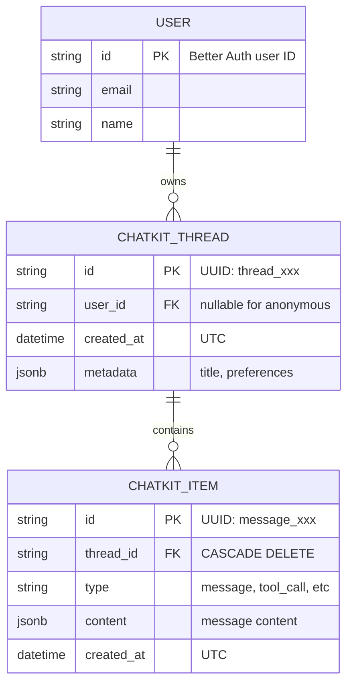
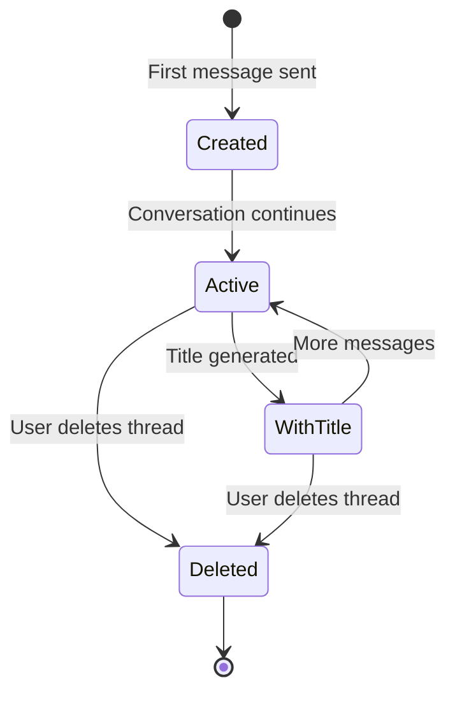

# Data Model: Chat Persistence

## Entity Relationship Diagram



## Tables

### chatkit_threads

Stores conversation threads linked to users.

| Column | Type | Constraints | Description |
|--------|------|-------------|-------------|
| `id` | TEXT | PRIMARY KEY | UUID format, e.g., `thread_abc123def456` |
| `user_id` | TEXT | INDEX, NULLABLE | FK to Better Auth user table. NULL for anonymous users |
| `created_at` | TIMESTAMPTZ | NOT NULL, DEFAULT NOW() | Thread creation timestamp (UTC) |
| `metadata` | JSONB | DEFAULT '{}' | Extensible metadata including `title` |

**Indexes:**
- `idx_chatkit_threads_user_id` on `user_id` for user isolation queries

**Metadata schema:**
```json
{
  "title": "Grocery shopping tasks",
  "user_id": "usr_123"
}
```

---

### chatkit_items

Stores messages and events within threads.

| Column | Type | Constraints | Description |
|--------|------|-------------|-------------|
| `id` | TEXT | PRIMARY KEY | UUID format, e.g., `message_abc123` |
| `thread_id` | TEXT | FK, NOT NULL, CASCADE DELETE | Reference to parent thread |
| `type` | TEXT | NOT NULL | Item type: `message`, `tool_call`, `tool_result` |
| `content` | JSONB | DEFAULT '{}' | Full message content |
| `created_at` | TIMESTAMPTZ | NOT NULL, DEFAULT NOW() | Item creation timestamp (UTC) |

**Indexes:**
- `idx_chatkit_items_thread_id` on `thread_id` for thread queries
- `idx_chatkit_items_created_at` on `created_at` for ordering

**Content schema (message type):**
```json
{
  "role": "user",
  "content": [
    {"type": "text", "text": "Create a task to buy groceries"}
  ]
}
```

---

## Relationships

### User → Thread (One-to-Many)
- One user can have many chat threads
- Anonymous users (user_id = NULL) have threads stored in localStorage only
- Cascade: User deletion does NOT delete threads (soft reference)

### Thread → Item (One-to-Many)
- One thread contains many items (messages, tool calls)
- CASCADE DELETE: Deleting a thread removes all its items
- Items are ordered by `created_at`

---

## State Transitions

### Thread Lifecycle



### Title Generation Flow

1. Thread created without title (`title: null` in metadata)
2. First user message processed
3. Async task generates 3-5 word title
4. Thread metadata updated with title
5. ThreadUpdatedEvent sent to frontend

---

## Validation Rules

### ChatKitThread

| Field | Validation |
|-------|------------|
| `id` | Required, unique, format: `thread_{12 hex chars}` |
| `user_id` | Optional (nullable for anonymous) |
| `created_at` | Required, UTC datetime |
| `metadata` | Valid JSON, max 10KB |

### ChatKitItem

| Field | Validation |
|-------|------------|
| `id` | Required, unique, format: `{type}_{12 hex chars}` |
| `thread_id` | Required, must reference existing thread |
| `type` | Required, enum: `message`, `tool_call`, `tool_result` |
| `content` | Valid JSON, max 100KB per item |
| `created_at` | Required, UTC datetime |

---

## SQLModel Classes

```python
from sqlmodel import SQLModel, Field
from sqlalchemy import Column
from sqlalchemy.dialects.postgresql import JSONB
from datetime import datetime, timezone


class ChatKitThread(SQLModel, table=True):
    __tablename__ = "chatkit_threads"

    id: str = Field(primary_key=True)
    user_id: str | None = Field(default=None, index=True)
    created_at: datetime = Field(
        default_factory=lambda: datetime.now(timezone.utc).replace(tzinfo=None)
    )
    metadata: dict = Field(default={}, sa_column=Column(JSONB, default={}))


class ChatKitItem(SQLModel, table=True):
    __tablename__ = "chatkit_items"

    id: str = Field(primary_key=True)
    thread_id: str = Field(foreign_key="chatkit_threads.id", index=True)
    type: str
    content: dict = Field(default={}, sa_column=Column(JSONB, default={}))
    created_at: datetime = Field(
        default_factory=lambda: datetime.now(timezone.utc).replace(tzinfo=None)
    )
```
