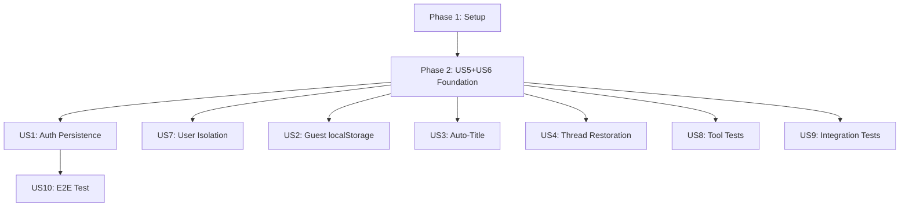

# Tasks: Chat Persistence & Testing

**Input**: Design documents from `/specs/009-chat-persistence/`
**Prerequisites**: plan.md (required), spec.md (required), data-model.md, quickstart.md

**Tests**: Tests ARE included as they are explicitly requested in the spec (80% coverage target).

**Organization**: Tasks are grouped by user story priority. Technical foundations (US5, US6) are in Phase 2 as they enable all other stories.

## Format: `[ID] [P?] [Story] Description`

- **[P]**: Can run in parallel (different files, no dependencies)
- **[Story]**: Which user story this task belongs to (e.g., US5, US6, US1)
- Include exact file paths in descriptions

## Path Conventions

- **Backend**: `todo-web-app/backend/src/`, `todo-web-app/backend/tests/`
- **Frontend**: `todo-web-app/frontend/src/`

---

## Phase 1: Setup

**Purpose**: Project initialization and dependency verification

- [x] T001 Verify project dependencies in `todo-web-app/backend/pyproject.toml` (sqlmodel, asyncpg, openai-chatkit)
- [x] T002 [P] Ensure `.env` has DATABASE_URL configured for Neon PostgreSQL
- [x] T003 [P] Verify existing chat module structure in `todo-web-app/backend/src/chat/`

---

## Phase 2: Foundational (Database Models & Store) 🎯 MVP Foundation

**Purpose**: Core infrastructure that MUST be complete before any persistence features work

**⚠️ CRITICAL**: User stories 1, 3, 4, 7 depend on this phase being complete

### User Story 5 - Database Persistence Models (P1)

**Goal**: Create SQLModel entities for chat threads and items

**Independent Test**: Run `alembic upgrade head` and verify tables exist

- [x] T004 [US5] Create ChatKitThread and ChatKitItem models in `todo-web-app/backend/src/models/chatkit.py`
- [x] T005 [US5] Update model exports in `todo-web-app/backend/src/models/__init__.py` to include ChatKitThread and ChatKitItem
- [x] T006 [US5] Generate Alembic migration with `alembic revision --autogenerate -m "add_chatkit_tables"`
- [x] T007 [US5] Review and verify migration file in `todo-web-app/backend/alembic/versions/`
- [x] T008 [US5] Apply migration with `alembic upgrade head`
- [x] T009 [US5] Verify cascade delete works by testing thread deletion in database

### User Story 6 - PostgresStore Implementation (P1)

**Goal**: Implement ChatKit Store protocol with PostgreSQL persistence

**Independent Test**: Run PostgresStore unit tests

- [x] T010 [P] [US6] Write unit tests for PostgresStore in `todo-web-app/backend/tests/test_postgres_store.py`
- [x] T011 [US6] Implement PostgresStore class in `todo-web-app/backend/src/chat/store.py`
- [x] T012 [US6] Implement `load_thread()` method with thread creation logic
- [x] T013 [US6] Implement `save_thread()` method with upsert and metadata update
- [x] T014 [US6] Implement `add_thread_item()` and `load_thread_items()` methods
- [x] T015 [US6] Implement `load_threads()` method with user isolation filter
- [x] T016 [US6] Implement `delete_thread()` method
- [x] T017 [US6] Run PostgresStore tests to verify: `uv run pytest tests/test_postgres_store.py -v`

**Checkpoint**: Foundation ready - PostgresStore passes all unit tests

---

## Phase 3: User Story 1 - Authenticated User Chat Persistence (P1) 🎯 MVP

**Goal**: Authenticated users have conversations persisted to database

**Independent Test**: Login, send message, restart server, verify conversation restored

### Implementation for User Story 1

- [x] T018 [US1] Update server.py to use PostgresStore instead of InMemoryStore in `todo-web-app/backend/src/chat/server.py`
- [x] T019 [US1] Create session factory integration for PostgresStore in `todo-web-app/backend/src/chat/server.py`
- [x] T020 [US1] Ensure user_id from auth context is passed to store methods
- [x] T021 [US1] Add integration test for authenticated persistence in `todo-web-app/backend/tests/test_chat.py`
- [x] T022 [US1] Run integration tests: `uv run pytest tests/test_chat.py -v`

**Checkpoint**: Authenticated users can persist and restore conversations

---

## Phase 4: User Story 7 - User Isolation (P1)

**Goal**: Users cannot access each other's chat history

**Independent Test**: Create threads for two users, verify isolation

### Implementation for User Story 7

- [x] T023 [US7] Add user isolation test in `todo-web-app/backend/tests/test_chat.py::TestUserIsolation`
- [x] T024 [US7] Verify load_threads() filters by user_id in PostgresStore
- [x] T025 [US7] Verify load_thread() creates new thread if accessed by wrong user
- [x] T026 [US7] Add test for anonymous user receiving empty thread list
- [x] T027 [US7] Run isolation tests: `uv run pytest tests/test_chat.py::TestUserIsolation -v`

**Checkpoint**: User isolation fully enforced, no cross-user data leakage

---

## Phase 5: User Story 2 - Guest User Local Storage Fallback (P1)

**Goal**: Guest users have thread_id stored in browser localStorage

**Independent Test**: Use chatbot without login, refresh page, verify conversation persists

### Implementation for User Story 2

- [x] T028 [US2] Verify frontend ChatBot component saves thread_id to localStorage key `chatkit_thread_anonymous`
- [x] T029 [US2] Verify initialThread prop in useChatKit reads from localStorage
- [x] T030 [US2] Verify onThreadChange callback saves to localStorage
- [x] T031 [US2] Test guest flow: send message, refresh, verify restoration

**Checkpoint**: Guest users can continue conversations within browser session

---

## Phase 6: User Story 3 - Auto-Title Generation (P2)

**Goal**: New threads get auto-generated titles from LLM

**Independent Test**: Send message to new thread, verify title appears within 5 seconds

### Implementation for User Story 3

- [x] T032 [US3] Verify `generate_title()` method exists in server.py
- [x] T033 [US3] Ensure title is saved to thread.metadata in PostgresStore
- [x] T034 [US3] Verify ThreadUpdatedEvent is sent after title generation
- [x] T035 [US3] Add fallback title logic for generation failures
- [x] T036 [US3] Test title generation flow with test message

**Checkpoint**: Threads display meaningful auto-generated titles

---

## Phase 7: User Story 4 - Thread Restoration on Login (P2)

**Goal**: Authenticated users auto-resume most recent conversation

**Independent Test**: Log out, log in, verify most recent thread loaded

### Implementation for User Story 4

- [x] T037 [US4] Verify frontend restoreLatestThread effect in ChatBot.tsx
- [x] T038 [US4] Test threads.list API returns most recent first (order: desc)
- [x] T039 [US4] Verify setThreadId is called with latest thread on login
- [x] T040 [US4] Test empty thread list creates new thread

**Checkpoint**: Returning users seamlessly resume their last conversation

---

## Phase 8: User Story 8 - Unit Tests for MCP Tools (P2)

**Goal**: MCP tools have ≥80% test coverage

**Independent Test**: Run `uv run pytest tests/test_chat_tools.py --cov=src/chat/tools`

### Tests for User Story 8

- [x] T041 [US8] Review existing tests in `todo-web-app/backend/tests/test_chat_tools.py`
- [x] T042 [P] [US8] Add test for add_task tool with valid input
- [x] T043 [P] [US8] Add test for list_tasks tool with status filtering
- [x] T044 [P] [US8] Add test for complete_task tool status change
- [x] T045 [P] [US8] Add test for delete_task tool removal
- [x] T046 [P] [US8] Add test for update_task tool field modification
- [x] T047 [US8] Run coverage report: `uv run pytest tests/test_chat_tools.py --cov=src/chat/tools --cov-report=term-missing`

**Checkpoint**: MCP tools have documented behavior and ≥80% coverage

---

## Phase 9: User Story 9 - Integration Tests for Chat Endpoint (P2)

**Goal**: `/api/chat` endpoint has comprehensive integration tests

**Independent Test**: Run `uv run pytest tests/test_chat.py -v`

### Tests for User Story 9

- [x] T048 [US9] Review existing tests in `todo-web-app/backend/tests/test_chat.py`
- [x] T049 [P] [US9] Add test for thread.respond creates thread in database
- [x] T050 [P] [US9] Add test for threads.list returns user's threads
- [x] T051 [P] [US9] Add test for streaming SSE response format
- [x] T052 [US9] Run all integration tests: `uv run pytest tests/test_chat.py -v --cov=src/chat`

**Checkpoint**: Chat endpoint passes all integration tests

---

## Phase 10: User Story 10 - E2E Chat Flow Test (P3)

**Goal**: End-to-end test: Login → Chat → Create task → Verify task exists

**Independent Test**: Run E2E test with browser automation

### Implementation for User Story 10

- [ ] T053 [US10] Create E2E test scenario in `todo-web-app/backend/tests/test_e2e_chat.py`
- [ ] T054 [US10] Test login flow with test user credentials
- [ ] T055 [US10] Test sending "Create a task to buy groceries" message
- [ ] T056 [US10] Verify chatbot response confirms task creation
- [ ] T057 [US10] Query tasks API to verify task exists
- [ ] T058 [US10] Run E2E test: `uv run pytest tests/test_e2e_chat.py -v`

**Checkpoint**: Full chat-to-task flow works end-to-end

---

## Phase 11: Polish & Cross-Cutting Concerns

**Purpose**: Final cleanup and documentation

- [ ] T059 [P] Update README with chat persistence setup instructions
- [ ] T060 [P] Run full test suite with coverage: `uv run pytest -v --cov=src --cov-report=html`
- [ ] T061 Verify coverage ≥80% for chat module
- [ ] T062 Run quickstart.md validation steps manually
- [ ] T063 Clean up any debug logging or temporary code

---

## Dependencies & Execution Order

### Phase Dependencies

- **Phase 1 (Setup)**: No dependencies - can start immediately
- **Phase 2 (Foundational - US5, US6)**: Depends on Setup - BLOCKS all other stories
- **Phase 3-5 (P1 Stories - US1, US7, US2)**: Depend on Phase 2
- **Phase 6-9 (P2 Stories - US3, US4, US8, US9)**: Depend on Phase 2, can run in parallel
- **Phase 10 (P3 Story - US10)**: Depends on US1 being complete (requires working persistence)
- **Phase 11 (Polish)**: Depends on all desired stories

### User Story Dependencies



### Parallel Opportunities

**Within Phase 2:**
- T010 (tests) can run parallel to T004-T005 (models)

**Within Phase 6-9:**
- All P2 stories can run in parallel after Phase 2 completes

**Within Phase 8:**
- T042-T046 (individual tool tests) can all run in parallel

---

## Parallel Example: Phase 2 Foundation

```bash
# Launch model creation and test writing in parallel:
Task: "Create ChatKitThread and ChatKitItem models in src/models/chatkit.py"
Task: "Write unit tests for PostgresStore in tests/test_postgres_store.py"

# Then sequentially:
Task: "Generate Alembic migration"
Task: "Apply migration"
Task: "Implement PostgresStore class"
```

---

## Implementation Strategy

### MVP First (Phases 1-4)

1. Complete Phase 1: Setup (3 tasks)
2. Complete Phase 2: Foundation - US5 + US6 (14 tasks)
3. Complete Phase 3: US1 - Auth Persistence (5 tasks)
4. Complete Phase 4: US7 - User Isolation (5 tasks)
5. **STOP and VALIDATE**: Test authenticated persistence and isolation
6. Deploy/demo if ready - **This is your MVP!**

### Incremental Delivery

| Delivery | Stories Complete | Value |
|----------|------------------|-------|
| MVP | US5, US6, US1, US7 | Auth users can persist/resume conversations |
| +Guest | +US2 | Anonymous users can try chatbot |
| +Polish | +US3, US4 | Better UX with titles and auto-resume |
| +Quality | +US8, US9, US10 | Full test coverage |

---

## Task Summary

| Phase | Story | Priority | Task Count | Cumulative |
|-------|-------|----------|------------|------------|
| 1 | Setup | - | 3 | 3 |
| 2 | US5 + US6 | P1 | 14 | 17 |
| 3 | US1 | P1 | 5 | 22 |
| 4 | US7 | P1 | 5 | 27 |
| 5 | US2 | P1 | 4 | 31 |
| 6 | US3 | P2 | 5 | 36 |
| 7 | US4 | P2 | 4 | 40 |
| 8 | US8 | P2 | 7 | 47 |
| 9 | US9 | P2 | 5 | 52 |
| 10 | US10 | P3 | 6 | 58 |
| 11 | Polish | - | 5 | 63 |

**Total: 63 tasks**

---

## Notes

- [P] tasks = different files, no dependencies
- [US#] label maps task to specific user story for traceability
- Each phase should be independently completable and testable
- Run tests after each phase to verify
- Commit after each task or logical group
- Stop at any checkpoint to validate story independently
