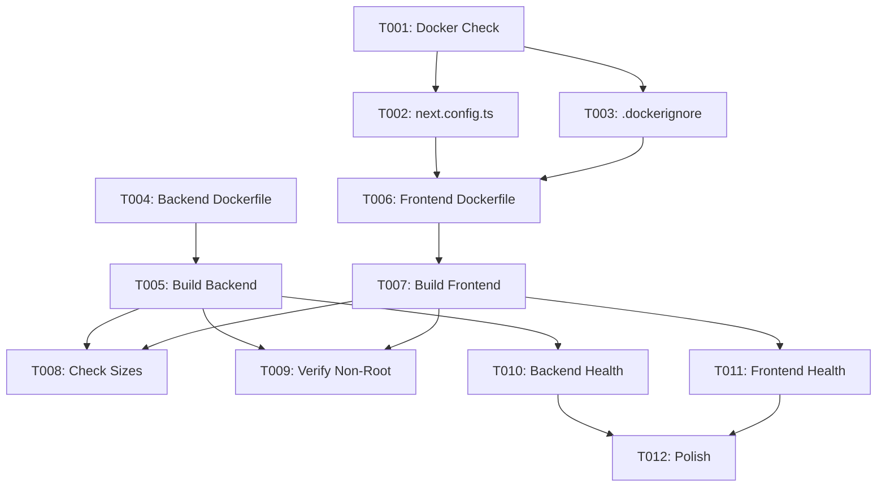

# Tasks: Production Containerization

**Branch**: `010-production-containerization` | **Generated**: 2026-01-31
**Spec**: [spec.md](./spec.md) | **Plan**: [plan.md](./plan.md)

---

## Summary

| Phase | Description | Task Count |
|-------|-------------|------------|
| 1 | Setup | 1 |
| 2 | Foundational | 2 |
| 3 | US1: Backend Docker Image | 2 |
| 4 | US2: Frontend Docker Image | 3 |
| 5 | US3: Security & Optimization | 1 |
| 6 | US4: Health Check Verification | 2 |
| 7 | Polish | 1 |
| **Total** | | **12** |

---

## Phase 1: Setup

*Project initialization and prerequisites*

- [x] T001 Verify Docker is installed and running: `docker info`

---

## Phase 2: Foundational

*Blocking prerequisites for all user stories*

- [x] T002 [P] Add `output: 'standalone'` to `todo-web-app/frontend/next.config.ts`
- [x] T003 [P] Create `todo-web-app/frontend/.dockerignore` with exclusions

---

## Phase 3: US1 - Build Backend Docker Image (P1)

*As a developer, I can build a production-ready Docker image for the FastAPI backend*

**Story Goal**: Backend container builds and starts successfully
**Independent Test**: `docker build -t todo-backend ./backend && docker run --rm todo-backend echo "OK"`

### Tasks

- [x] T004 [US1] Update `todo-web-app/backend/Dockerfile` to use PORT env var (default 8000)
- [x] T005 [US1] Build backend image and verify: `docker build -t todo-backend todo-web-app/backend`

---

## Phase 4: US2 - Build Frontend Docker Image (P2)

*As a developer, I can build a production-ready Docker image for the Next.js frontend*

**Story Goal**: Frontend container builds and starts successfully
**Independent Test**: `docker build -t todo-frontend ./frontend && docker run --rm todo-frontend echo "OK"`

### Tasks

- [x] T006 [US2] Rewrite `todo-web-app/frontend/Dockerfile` with multi-stage production build
- [x] T007 [US2] Build frontend image and verify: `docker build -t todo-frontend todo-web-app/frontend`
- [x] T008 [US2] Check image sizes: `docker images | grep todo` (target: <200MB backend, <150MB frontend)

---

## Phase 5: US3 - Secure and Optimized Images (P3)

*As DevOps, the Docker images are optimized for production with security best practices*

**Story Goal**: Containers run as non-root users with minimal footprint
**Independent Test**: `docker run --rm todo-backend whoami` returns `appuser`

### Tasks

- [x] T009 [US3] Verify non-root users: backend (`appuser`), frontend (`nextjs`)

---

## Phase 6: US4 - Health Check Endpoints (P4)

*As DevOps, health check endpoints are available for Kubernetes probes*

**Story Goal**: Health endpoints respond correctly
**Independent Test**: `curl http://localhost:8000/api/health` returns 200

### Tasks

- [x] T010 [US4] Run backend container and verify `/api/health` endpoint
- [x] T011 [US4] Run frontend container and verify root URL responds

---

## Phase 7: Polish

*Cross-cutting concerns and documentation*

- [x] T012 Update quickstart.md with final verification commands

---

## Dependencies



---

## Parallel Execution

### Round 1 (Setup)
- T001: Docker check

### Round 2 (Foundational - Parallel)
- T002: next.config.ts update [P]
- T003: .dockerignore creation [P]

### Round 3 (Backend - Sequential)
- T004: Backend Dockerfile update

### Round 4 (Frontend - Sequential after T002, T003)
- T006: Frontend Dockerfile rewrite

### Round 5 (Build - Parallel)
- T005: Build backend [P] (after T004)
- T007: Build frontend [P] (after T006)

### Round 6 (Verification - Parallel)
- T008: Check sizes [P]
- T009: Verify non-root [P]
- T010: Backend health [P]
- T011: Frontend health [P]

### Round 7 (Polish)
- T012: Documentation update

---

## Implementation Strategy

### MVP Scope
**User Story 1 only** (T001-T005): Backend Docker image build and run

### Incremental Delivery
1. **Increment 1**: Backend containerization (US1)
2. **Increment 2**: Frontend containerization (US2)
3. **Increment 3**: Security verification (US3)
4. **Increment 4**: Health check verification (US4)

---

## Verification Commands

```bash
# Build both images
docker build -t todo-backend todo-web-app/backend
docker build -t todo-frontend todo-web-app/frontend

# Check sizes
docker images | grep todo

# Verify non-root
docker run --rm todo-backend whoami
docker run --rm todo-frontend whoami

# Test health (requires running containers with proper env vars)
# Backend: curl http://localhost:8000/api/health
# Frontend: curl http://localhost:3000
```
