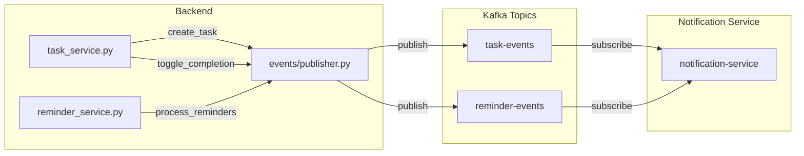

# Data Model: Dapr Integration Events

**Branch**: `014-dapr-integration`
**Created**: 2026-02-07

---

## Overview

This document defines the event entities and their schemas for the event-driven architecture.

> **NOTE**: No database schema changes required. Events are published to Kafka, not stored in PostgreSQL.

---

## Event Entities

### TaskCreatedEvent

Published when a new task is successfully created.

| Field | Type | Required | Description |
|-------|------|----------|-------------|
| `event_type` | string | Yes | Always `"TaskCreated"` |
| `task_id` | integer | Yes | Database ID of created task |
| `user_id` | string | Yes | UUID of task owner |
| `title` | string | Yes | Task title |
| `due_date` | string \| null | No | ISO8601 datetime or null |
| `priority` | string | No | `"high"`, `"medium"`, `"low"`, or null |
| `timestamp` | string | Yes | ISO8601 event timestamp |

**Topic**: `task-events`

---

### TaskCompletedEvent

Published when a task is marked as complete.

| Field | Type | Required | Description |
|-------|------|----------|-------------|
| `event_type` | string | Yes | Always `"TaskCompleted"` |
| `task_id` | integer | Yes | Database ID of completed task |
| `user_id` | string | Yes | UUID of task owner |
| `title` | string | Yes | Task title (for notification context) |
| `completed_at` | string | Yes | ISO8601 completion timestamp |
| `timestamp` | string | Yes | ISO8601 event timestamp |

**Topic**: `task-events`

---

### TaskDueReminderEvent

Published when a task approaches its due date.

| Field | Type | Required | Description |
|-------|------|----------|-------------|
| `event_type` | string | Yes | Always `"TaskDueReminder"` |
| `task_id` | integer | Yes | Database ID of task |
| `user_id` | string | Yes | UUID of task owner |
| `title` | string | Yes | Task title |
| `due_date` | string | Yes | ISO8601 due date |
| `time_until_due` | integer | Yes | Seconds until due (negative if overdue) |
| `reminder_id` | integer | Yes | Database ID of reminder record |
| `urgency` | string | Yes | `"overdue"`, `"soon"`, `"upcoming"` |
| `timestamp` | string | Yes | ISO8601 event timestamp |

**Topic**: `reminder-events`

---

### TaskUpdateEvent

Published for real-time multi-client sync (SDD Use Case 4).

| Field | Type | Required | Description |
|-------|------|----------|-------------|
| `event_type` | string | Yes | `"TaskUpdated"`, `"TaskDeleted"` |
| `task_id` | integer | Yes | Database ID of task |
| `user_id` | string | Yes | UUID of task owner |
| `action` | string | Yes | `"create"`, `"update"`, `"delete"`, `"complete"` |
| `task_data` | object | No | Full task object (for create/update) |
| `timestamp` | string | Yes | ISO8601 event timestamp |

**Topic**: `task-updates`

---

### RecurringTaskTriggerEvent (Future)

Published when a recurring pattern should generate a new task instance.

| Field | Type | Required | Description |
|-------|------|----------|-------------|
| `event_type` | string | Yes | Always `"RecurringTaskTrigger"` |
| `pattern_id` | integer | Yes | Database ID of recurring pattern |
| `source_task_id` | integer | Yes | Original task ID |
| `user_id` | string | Yes | UUID of task owner |
| `timestamp` | string | Yes | ISO8601 event timestamp |

**Topic**: `recurring-events`

> **Scope**: This event is defined for completeness but will be implemented in a future module.

---

## Kafka Topics

| Topic Name | Purpose | Consumer | Partitions | Retention |
|------------|---------|----------|------------|-----------|
| `task-events` | Task lifecycle (created, completed, deleted) | recurring-service, audit-service | 3 | 7 days |
| `reminder-events` | Due date reminders | notification-service | 3 | 7 days |
| `task-updates` | Real-time client sync | websocket-service | 3 | 1 day |
| `recurring-events` | Recurring pattern triggers (future) | recurring-service | 3 | 7 days |

---

## Pydantic Models (Python)

```python
# src/events/models.py
from datetime import datetime
from pydantic import BaseModel


class BaseEvent(BaseModel):
    timestamp: datetime

    class Config:
        json_encoders = {
            datetime: lambda v: v.isoformat()
        }


class TaskCreatedEvent(BaseEvent):
    event_type: str = "TaskCreated"
    task_id: int
    user_id: str
    title: str
    due_date: datetime | None = None
    priority: str | None = None


class TaskCompletedEvent(BaseEvent):
    event_type: str = "TaskCompleted"
    task_id: int
    user_id: str
    title: str
    completed_at: datetime


class TaskDueReminderEvent(BaseEvent):
    event_type: str = "TaskDueReminder"
    task_id: int
    user_id: str
    title: str
    due_date: datetime
    time_until_due: int  # seconds
    reminder_id: int
    urgency: str  # "overdue", "soon", "upcoming"
```

---

## Entity Relationships



---

## Dapr Subscription Mapping

| Topic | Route | Handler |
|-------|-------|---------|
| `task-events` | `/events/task` | Process task lifecycle events |
| `reminder-events` | `/events/reminder` | Send external notifications |
